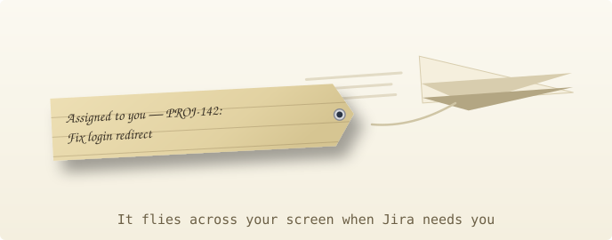

<p align="center"></p>

<p align="center"><code>MIT</code> <code>electron, one dependency</code> <code>macOS</code>&ensp;<samp><a href="https://github.com/godfreyponce">github</a> / <a href="https://www.linkedin.com/in/godfreyponce/">linkedin</a> / <a href="https://godfreyponce.dev">personal website</a></samp></p>

A paper airplane that flies across your screen when something happens to you in
Jira: someone hands you a ticket, someone @mentions you, someone comments on a
ticket you're working on. You can click the banner mid-flight to open the ticket.

This is basically [Jira-Alerts](https://github.com/godfreyponce/Jira-Alerts) with
an upgraded visual. I already had Jira-Alerts wired up, a Python script that DMs
me on Teams when Jira needs me. Then I saw
[@conniecodes](https://www.instagram.com/p/DYqJoeVvI8c/)' flying paper airplane on
Instagram and thought: what if I just wire it up and merge the two together. So
the plane took over the Teams DMs and the old script's timer retired.

<!-- SHOT 01, click-to-play mp4: the real thing. Cargo-tag plane crossing an
     actual working desktop, both displays, whoosh audio. Fake ticket data
     through the real pipeline (Jira-Alerts capture protocol). Owner mints the
     user-attachments URL at PR review; paste it on its own line here. -->

<p align="center"></p>

## What counts as news

The poller asks Jira every minute and looks for these 4 things: a comment on a
ticket assigned to you, an @mention anywhere, a ticket newly assigned to you, and
when it gets reassigned to someone else. That last one never flies a plane, it
only goes to Teams DMs. Your own comments never count.

- First run seeds silently, so day one is not a plane storm.
- More than 3 events in one cycle collapse into a single digest flight ("7 Jira updates").
- A comment older than 30 minutes never flies, even on a ticket you just got.

## You can touch it

The overlay is basically HTML. `plane.html` is one ordinary web page, and the
plane, the tag, the rope, and the smoke are all HTML and CSS being animated. When
news lands, the app lays an invisible window over each display: a sheet of glass
the size of your screen, transparent, no frame, never focused, pinned above every
app, the Dock, and the menu bar. plane.html loads onto that glass, and wherever
the page draws nothing you just see your desktop.

The glass ignores your mouse, so clicks fall straight through to whatever you're
working in. But the page still watches the cursor move, and the moment it's over
the plane or the tag it flips to catching clicks. So the overlay is click-through
except where it isn't:

- Click the towed tag and the ticket opens in your browser.
- Grab the plane and drag it out of the way. The flight clock freezes while you
  hold it, and it springs back and finishes the crossing from wherever you drop
  it. Drop it near the exit and the flight ends early.
- It tolerates three grabs per flight. On the third release it stops responding
  to the cursor and bolts for the exit at four times cruise speed.

<!-- SHOT 03, click-to-play mp4: grab, drag, release. The spring-back at the
     drop height, then the third grab and the fast exit. Owner mints the
     user-attachments URL at PR review; paste it on its own line here. -->

<p align="center"></p>

## Physics

The physics is what lets the plane hold the tag with weight and gravity and an
air-drag feel, all tuned by hand on feel sliders.

There's a second banner style in the tray: Skywriter writes the message as smoke
letters along the flight path, laid down the moment the tail crosses each one.

<!-- SHOT 02, gif or mp4: Skywriter flight. Smoke letters condensing along the
     swoop, glowing then drifting up. Owner mints the user-attachments URL at
     PR review; paste it on its own line here. -->

## Get your own

I built this for my own desk, but really this part is for my coworkers, so you
can get one too. Each of you runs your own copy: your clone, your Jira token,
optionally your own webhook, and nobody can see anyone else's tickets. Not a
coworker? It still works anywhere with a Mac, a Jira Data Center account, and
Node.

> [!NOTE]
> [docs/ONBOARDING.md](docs/ONBOARDING.md) walks you through the whole thing from
> zero: creating the token, finding your user key, picking your outputs, starting
> at login. About 15 minutes, 30 if you also want Teams DMs, and none of it needs
> Jira admin rights.

```bash
npm install
npm start                 # plane icon lands in the menu bar; "Test flight" fires a fake plane
cp .env.example .env      # four Jira values; docs/ONBOARDING.md shows where they come from
./scripts/install-login-launch.sh   # optional: start at login, restart after a crash
```

Outputs are independent: plane only by default, set `TEAMS_WEBHOOK_URL` for DMs
too, add `PLANE=0` for DMs without the plane.

## Things to know

- Runs on your Mac.
- macOS supported only (for now).
- When your PAT expires, it's quiet. Set a reminder.
- Since it runs on your Mac, keep the Mac awake. That is the only way polling
  stays alive.

More: [one-pager](https://godfreyponce.github.io/jiraPlane/) for non-technical
visitors, [docs/](docs/), and the predecessor,
[Jira-Alerts](https://github.com/godfreyponce/Jira-Alerts)

<sub>MIT © 2026 Godfrey Ponce</sub>
